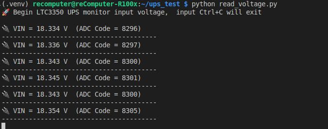

# Introduction

This repository uses a Python script to read the UPS input voltage on the R1000.

## Hardware requirement

|                                               Raspberry Pi AI Kit                                               |                                               reComputer R1100                                               |
| :----------------------------------------------------------------------------------------------------------------: | :-----------------------------------------------------------------------------------------------------------: |
|  |  |
| [**Purchase Now**](https://www.seeedstudio.com/SuperCAP-UPS-LTC3350-Module-p-5934.html?utm_source=PiAICourse&utm_medium=github&utm_campaign=Course) | [**Purchase Now**](https://www.seeedstudio.com/reComputer-R1125-10-p-6256.html?utm_source=PiAICourse&utm_medium=github&utm_campaign=Course) |

## Quikly begin

```
git clone https://github.com/Seeed-Projects/Read-UPS-input-voltage.git
cd Read-UPS-input-voltage
sudo apt update
sudo apt install python3-smbus i2c-tools
python -m venv .venv --system-site-packages && source .venv/bin/activate
python read_voltage.py
```

## Result


